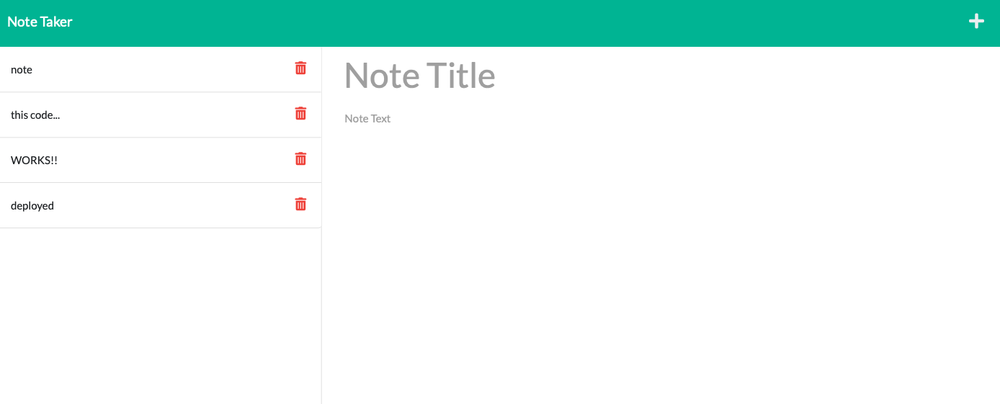

# note-taker

## license 

## Description
Geared toward small business owners who want to be able to organize their thoughts and keep track of tasks.

## Install
* use node packages
* deployed with heroku 

## Usage
* when a user clicks + icon 
* user can add notes and save them to the database by clicking the save icon
* saved notes are then stored in the left side bar

## Preview

## Links
*Deployed using Heroku: https://mysterious-sands-29258.herokuapp.com
*Repository: https://github.com/AmyWilhoite/note-taker.git   

